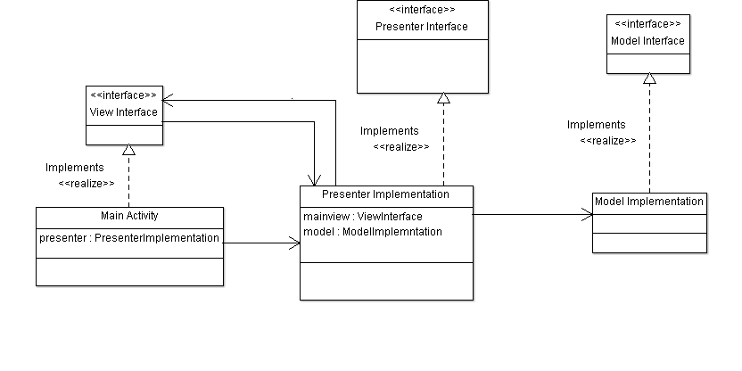

# MVP Android Simple Example
Simple example to demonstrate how to implement mvp architecture to your android app.
This example doens't use any library or complix logic it is focused entirely on MVP implementation
 
 

## Screenshots:
 

 
 

## MVP Features:
* Improve the application architecture to increase testability. 
* Separates the data model, from a view through a presenter.
 
 

## Class Diagram:
Simple class diagram to demonstrate how this mvp code works
 

 
 

## References:
* [Android MVP Article](http://www.digigene.com/architecture/android-architecture-part-3-mvp/)
* [Vogella Android MVP](http://www.vogella.com/tutorials/AndroidArchitecture/article.html#the-model-view-presenter-architecture-for-android)
* [MVP Tutorial in Arabic] (https://www.youtube.com/watch?v=F_x5wLdd3Ik)
 
 
